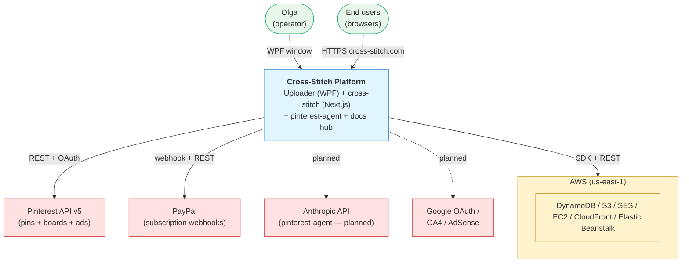
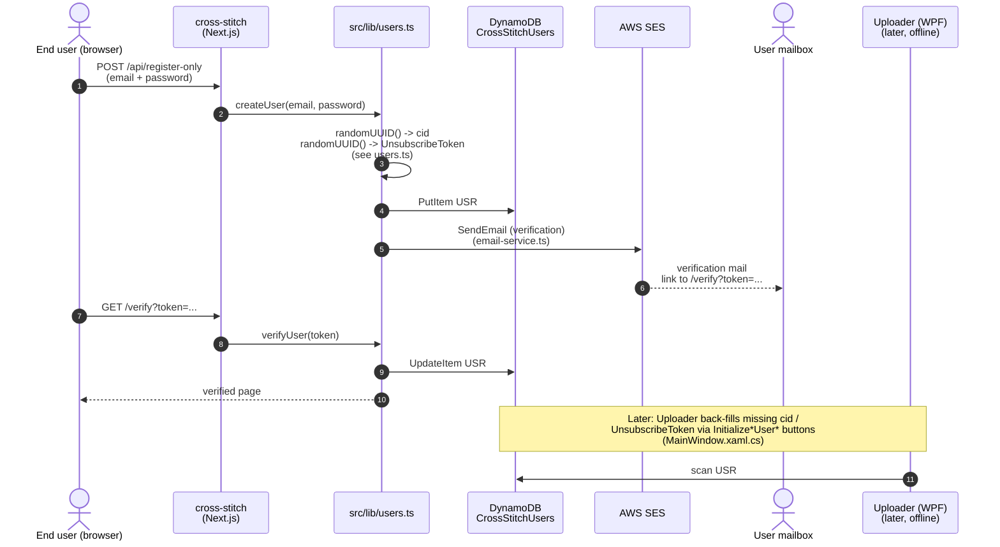

# Cross-Stitch Platform — Architecture Diagrams

> Visual companion to [platform-architecture-summary.md](./platform-architecture-summary.md). The summary carries the narrative and the cited inventory tables; this document carries the diagrams (system context, component view, and critical-flow sequences). Cross-reference both.

## 1. Purpose

This document adds the visual layer that `platform-architecture-summary.md` deliberately omits:

- A **system-context** diagram showing the platform as a single box with its human operators, end users, and third-party APIs around it.
- A **component view** with subgraph clusters for each repo, each AWS service, each external API, and the shared files that glue them together — every edge is labeled with a file path or an existing integration contract.
- **Sequence diagrams** for the four flows that actually cross repo boundaries: design publish, user registration + verification, newsletter blast, and Pinterest pin creation.
- A **reconciliation** with `plan/integration/INTEGRATION-MAP.md` (which already carries a Mermaid map, but at a coarser granularity) so we have one canonical "exists-map" instead of two competing ones.

Detailed cross-repo contracts (DDB attributes, S3 paths, pin metadata, etc.) live in the per-topic contracts under `docs/integration/` and are referenced from edge labels rather than re-stated here.

## 2. System context

Single-box view of the Cross-Stitch platform with its operators, end users, and external systems.



Key facts behind this view (cited from `platform-architecture-summary.md`):

- Three sibling repos coordinated through one docs hub — no HTTP API between Uploader and cross-stitch; all coupling is through shared AWS resources and a shared Pinterest token file (`platform-architecture-summary.md:5-10`, `:249`).
- The operator runs Uploader locally on Windows (`net8.0-windows`); end users hit the Next.js app on Elastic Beanstalk (`platform-architecture-summary.md:53`, `:68-69`, `:226-227`).
- Pinterest is the only external API used by both Uploader (active publisher) and pinterest-agent (analytics + ads) (`platform-architecture-summary.md:208`).
- Anthropic / Google OAuth / GA4 / AdSense are documented-only — not yet in code (`platform-architecture-summary.md:210-211`).

## 3. Component view

Subgraph clusters for the three runtime repos, the AWS services, the external APIs, and the shared files that pin everything together.

```mermaid
flowchart TD
    subgraph Repos["Runtime repos"]
        UPL["<b>Uploader</b><br/>WPF / net8.0-windows<br/>MainWindow.xaml.cs"]
        CS["<b>cross-stitch</b><br/>Next.js 15 / React 19 / TS<br/>App Router under src/"]
        PA["<b>pinterest-agent</b><br/>TS scripts in cross-stitch/<br/>automation/pinterest-agent/<br/>(Windows Task Scheduler)"]
    end

    subgraph AWS["AWS (us-east-1)"]
        DDB_ITEMS[("<b>DynamoDB</b><br/>CrossStitchItems<br/>(DESIGN / ALBUM / USR#)")]
        DDB_USERS[("<b>DynamoDB</b><br/>CrossStitchUsers<br/>(USR#email)")]
        S3_DESIGNS[("<b>S3</b><br/>cross-stitch-designs<br/>(photos/, pdfs/, charts/)")]
        S3_SITEMAP[("<b>S3</b><br/>cross-stitch-sitemap-cache")]
        CF["<b>CloudFront</b><br/>d2o1uvvg91z7o4.cloudfront.net"]
        EB["<b>Elastic Beanstalk</b><br/>app cross-stitch-com<br/>env cross-stitch-com-env-clone"]
        SES["<b>SES</b><br/>SendEmail / SendRawEmail"]
        EC2["<b>EC2</b><br/>(reboot by Name tag)"]
    end

    subgraph External["External APIs"]
        PIN["Pinterest API v5"]
        PP["PayPal"]
        ANTH["Anthropic"]
        GA["GA4 / AdSense"]
    end

    subgraph Shared["Shared files"]
        PCFG["<b>platform-config.json</b><br/>(docs hub root)"]
        PTOK["<b>pinterest_tokens.json</b><br/>(Uploader/secrets/)"]
        ABCSV["<b>AlbumBoards.csv</b><br/>(Uploader/)"]
    end

    %% Uploader edges
    UPL -->|writes designs / users — see dynamodb-schema.md, MainWindow.xaml.cs:1057| DDB_ITEMS
    UPL -->|writes user maint. rows — see dynamodb-schema.md, MainWindow.xaml.cs InitializeUser*| DDB_USERS
    UPL -->|uploads chart / PDF / photo — see s3-paths.md, S3Helper.cs| S3_DESIGNS
    UPL -->|creates pins + boards — see pinterest-metadata.md, PinterestHelper.cs| PIN
    UPL -->|newsletter blast — EmailHelper.cs, MainWindow.xaml.cs:194/241| SES
    UPL -->|restart env — ElasticBeanstalkHelper.cs, MainWindow.xaml.cs:367| EB
    UPL -->|reboot — EC2Helper.cs| EC2
    UPL -->|reads token store path — Helpers/PlatformConfig.cs| PCFG
    UPL -->|reads + writes OAuth tokens — Helpers/PinterestTokenInfo.cs| PTOK
    UPL -->|reads AlbumID -> BoardID — Helpers/PinterestHelper.cs| ABCSV

    %% cross-stitch edges
    CS -->|reads designs / albums — src/lib/data-access.ts| DDB_ITEMS
    CS -->|reads + writes users + likes + subs — src/lib/users.ts, design-likes.ts, subscription-events.ts| DDB_USERS
    CS -->|image + PDF fetch via CDN — next.config.js remotePatterns| CF
    CF -->|origin| S3_DESIGNS
    CS -->|sitemap cache reads| S3_SITEMAP
    CS -->|transactional + password reset — src/lib/email-service.ts, password-reset-email.ts| SES
    CS -->|hosted on| EB
    CS -->|subscription webhooks — src/app/api/paypal-webhook/route.js| PP
    CS -->|PinterestSaveLink — documented-only| PIN

    %% pinterest-agent edges
    PA -->|analytics + Ads API — pinterestClient.ts, test-pinterest-ads.ts| PIN
    PA -->|reads design rows for pin map — export-design-pin-map.ts| DDB_ITEMS
    PA -->|reads token store path — readPlatformConfig.ts| PCFG
    PA -->|reads OAuth tokens — readPinterestToken.ts| PTOK
    PA -.->|planned blast — Pinterest AI Agent — AWS Deployment.md| SES
    PA -.->|planned reasoning — Pinterest AI Agent — AI Reasoning.md| ANTH
    PA -.->|planned ingest — Pinterest AI Agent — API Integrations.md| GA

    %% Browser edge (end users)
    BR(["Browser<br/>(end users)"]) -->|HTTPS| CS
    BR -->|images + PDFs| CF

    classDef repo fill:#e1f5ff,stroke:#06c
    classDef aws fill:#fff3cd,stroke:#b8860b
    classDef external fill:#ffe1e1,stroke:#c33
    classDef shared fill:#e8f5e9,stroke:#2a7

    class UPL,CS,PA repo
    class DDB_ITEMS,DDB_USERS,S3_DESIGNS,S3_SITEMAP,CF,EB,SES,EC2 aws
    class PIN,PP,ANTH,GA external
    class PCFG,PTOK,ABCSV shared
```



### Notes on edges

- **Solid arrows** = observed in code today.
- **Dashed arrows** = documented-only / aspirational (pinterest-agent → SES / Anthropic / GA — see `Pinterest AI Agent — AWS Deployment.md` and `— AI Reasoning.md`).
- Every edge label cites either a source file (path + optional line) or one of the six existing contracts (`docs/integration/{album-id,design-id,dynamodb-schema,s3-paths,pdf-structure,pinterest-metadata}.md`).
- The S3 → CloudFront → cross-stitch chain is shown explicitly because cross-stitch never names the `cross-stitch-designs` bucket — it only reads through `d2o1uvvg91z7o4.cloudfront.net` (`platform-architecture-summary.md:187`, `:206`).
- `platform-config.json` is the only file consumed by both Uploader (`Helpers/PlatformConfig.cs`) and pinterest-agent (`readPlatformConfig.ts`); it carries `pinterestTokenPath = "Uploader/secrets/pinterest_tokens.json"` (`platform-architecture-summary.md:124-125`, `:157`).

## 4. Critical flows

Four flows that cross at least one repo or AWS boundary.

### F1 — Design publish (write side)

Operator → WPF → S3 (chart) → S3 (PDF) → S3 (photo) → Pinterest → DynamoDB → EB restart. Driven by `RunFullUploadFlowAsync` at `MainWindow.xaml.cs:634`; see [upload-flow.md](../integration/upload-flow.md), [s3-paths.md](../integration/s3-paths.md), [pdf-structure.md](../integration/pdf-structure.md), [pinterest-metadata.md](../integration/pinterest-metadata.md), [dynamodb-schema.md](../integration/dynamodb-schema.md).

```mermaid
sequenceDiagram
    autonumber
    actor Op as Olga (operator)
    participant UPL as Uploader (WPF)<br/>MainWindow.xaml.cs
    participant S3 as S3 cross-stitch-designs
    participant PIN as Pinterest API v5
    participant DDB as DynamoDB<br/>CrossStitchItems
    participant EB as Elastic Beanstalk<br/>cross-stitch-com-env-clone

    Op->>UPL: Click "Upload" (BtnUpload_Click line 160)
    UPL->>S3: UploadChartToS3Async line 930<br/>(charts/{DesignID:D5}_*)
    UPL->>S3: UploadPdfToS3Async line 946<br/>(pdfs/{AlbumID}/Stitch{DesignID}_Kit.pdf<br/>+ size variants 1/3/5)
    UPL->>S3: UploadImageToS3Async line 1031<br/>(photos/{AlbumID}/{DesignID}/4.jpg)
    UPL->>PIN: PinterestHelper.CreatePin<br/>(see pinterest-metadata.md)
    PIN-->>UPL: Pin ID
    UPL->>DDB: InsertItemIntoDynamoDbAsync line 1057<br/>(EntityType=DESIGN, PinID, photo/pdf keys)
    UPL->>EB: ElasticBeanstalkHelper.RestartEnvironmentAsync<br/>(step 5; auto)
    EB-->>UPL: restart OK
    UPL-->>Op: upload complete
```

Cited contracts: [s3-paths.md](../integration/s3-paths.md) (bucket + path templates), [pdf-structure.md](../integration/pdf-structure.md) (variant set `{1,3,5}` + Converter.exe), [pinterest-metadata.md](../integration/pinterest-metadata.md) (pin title/desc templates, board CSV), [dynamodb-schema.md](../integration/dynamodb-schema.md) (PinID + the rest of the DESIGN row).

### F2 — User registration + verification email

Browser → Next.js `api/register-only` → DDB `CrossStitchUsers` row (`USR#email` with `cid` + `UnsubscribeToken`) → SES verification email → user clicks link → `verifyUser` flips `Verified=true`. Cross-repo touchpoints: both `cid` and `UnsubscribeToken` are later read/back-filled by Uploader.



Cited contracts: [dynamodb-schema.md](../integration/dynamodb-schema.md) (`CrossStitchUsers` PK + `cid` + `UnsubscribeToken` attribute definitions). See also `platform-architecture-summary.md:167`, `:169`, `:181` (two-writer risk on `UnsubscribeToken`).

### F3 — Newsletter blast

Operator → WPF "Send Emails" → DDB read recipients → SES `SendEmail` per user → unsubscribe URL embedded (raw `UnsubscribeToken` from the DDB row, URL-escaped via `Uri.EscapeDataString` — no HMAC; `UnsubscribeSecret` in `App.private.config.example` is dead config, see [user-identity.md](../integration/user-identity.md) and [email-and-unsubscribe.md](../integration/email-and-unsubscribe.md)).

```mermaid
sequenceDiagram
    autonumber
    actor Op as Olga (operator)
    participant UPL as Uploader (WPF)<br/>MainWindow.xaml.cs
    participant DDB as DynamoDB<br/>CrossStitchUsers
    participant Templates as Templates/HtmlEmailTemplate.txt<br/>(or plan/uploader/*.txt)
    participant SES as AWS SES
    actor Mail as Subscriber mailbox

    Op->>UPL: Click "Send Emails" (BtnSendEmails_Click line 194)
    UPL->>DDB: scan USR# rows<br/>where Subscribed = true
    DDB-->>UPL: list of {Email, UnsubscribeToken, cid, ...}
    UPL->>Templates: read HTML + text body<br/>(App.config absolute path,<br/>falls back to bundled Templates/)
    loop for each recipient
        UPL->>UPL: BuildUnsubscribeUrlFromStoredToken line 2316<br/>(URL-escapes raw UnsubscribeToken; no HMAC)
        UPL->>SES: EmailHelper.SendEmail / SendRawEmail<br/>(see EmailHelper.cs)
        SES-->>Mail: newsletter with<br/>cross-stitch.com/unsubscribe?token=...
    end
    UPL-->>Op: progress + completion<br/>(SendNotificationEmailsAsync line 678)
```

Cited contracts: [dynamodb-schema.md](../integration/dynamodb-schema.md) (`UnsubscribeToken` writer/reader columns on `CrossStitchUsers`). See `platform-architecture-summary.md:104`, `:110`, `:181`, `:203` (Uploader uses SES for blasts; the unsubscribe URL contract is `both-observed` and `https://cross-stitch.com/unsubscribe?token=<UnsubscribeToken>`).

### F4 — Pinterest pin creation

Operator → WPF → Pinterest API v5 `POST /v5/pins` (with `pin.link` to the design URL) → returned pin ID → DDB `PinID` attribute on the DESIGN row. The design URL on `pin.link` is built by `PatternLinkHelper.BuildPatternUrl` (one of the three places that build this URL — see [pinterest-metadata.md](../integration/pinterest-metadata.md)).

```mermaid
sequenceDiagram
    autonumber
    actor Op as Olga (operator)
    participant UPL as Uploader (WPF)<br/>PinterestHelper.cs
    participant TOK as Helpers/PinterestTokenInfo.cs<br/>(secrets/pinterest_tokens.json)
    participant CSV as AlbumBoards.csv
    participant LINK as PatternLinkHelper.cs<br/>(BuildPatternUrl)
    participant PIN as Pinterest API v5
    participant DDB as DynamoDB<br/>CrossStitchItems

    Op->>UPL: trigger pin creation<br/>(invoked from RunFullUploadFlowAsync line 634<br/>or BtnTestPinterest_Click line 396)
    UPL->>TOK: GetValidAccessToken()<br/>(refreshes if expired)
    TOK-->>UPL: access_token
    UPL->>CSV: lookup BoardID by AlbumID:D4
    CSV-->>UPL: BoardID
    UPL->>LINK: build design URL<br/>(/{Caption}-{AlbumID}-{NPage-1}-Free-Design.aspx)
    LINK-->>UPL: pin.link
    UPL->>PIN: POST /v5/pins<br/>{board_id, title, description,<br/>link, media: photo URL}
    PIN-->>UPL: 201 Created (pin id)
    UPL->>DDB: UpdateItem DESIGN row<br/>SET PinID = {id}
    UPL-->>Op: pin created
```

Cited contracts: [pinterest-metadata.md](../integration/pinterest-metadata.md) (title/desc templates, scopes `pins:read pins:write boards:read boards:write ads:read`, `AlbumBoards.csv` format), [album-id.md](../integration/album-id.md) (`D4` zero-padded form for the CSV key), [design-id.md](../integration/design-id.md) (URL slug uses `NPage-1` not `DesignID`), [dynamodb-schema.md](../integration/dynamodb-schema.md) (`PinID` attribute + the six historical names cross-stitch defensively reads).

## 5. Reconciliation with plan/integration/INTEGRATION-MAP.md

`plan/integration/INTEGRATION-MAP.md` already carries a coarse Mermaid diagram. Comparing the two:

| Edge | In plan-side INTEGRATION-MAP? | In this doc? | Notes |
|---|---|---|---|
| Uploader → Web app ("Uploads, Metadata, Status") | yes | **no** | Not supported by code: there is **no HTTP API between Uploader and cross-stitch** (`platform-architecture-summary.md:249`). All coupling is via shared AWS resources and the Pinterest token file. The plan-side edge is aspirational — the "Example Future API Contract" in `plan/cross-stitch/Pinterest AI Agent — WPF Uploader Integration.md`. |
| Uploader → AWS (S3 / DynamoDB / SES / EC2 / EB) | partial (S3 + auth only) | yes | Plan-side merges all AWS into one `AWS` node; this doc breaks AWS into the five services Uploader actually touches, with file-level citations. |
| Uploader → Pinterest | yes | yes | Same edge — this doc adds the `AlbumBoards.csv` lookup and `pinterest_tokens.json` token store as separate "shared file" nodes. |
| Web app → AWS | partial | yes | Same shape but this doc splits CloudFront + S3 + DDB tables; plan-side has only one combined node. |
| Web app → Pinterest ("Board/Pin Sync, Analytics") | yes | **partial** | Plan-side overstates: the Next.js site only has `PinterestSaveLink` (documented-only client component); the real analytics/Ads consumer is `automation/pinterest-agent/` (a separate sub-project running via Task Scheduler). This doc surfaces pinterest-agent as its own runtime node. |
| Web app → PayPal | yes | yes | Same edge — this doc names the route `api/paypal-webhook`. |
| Pinterest → Web app + Pinterest → Uploader (incoming) | yes | **no separate arrow** | The plan-side bidirectional arrows are double-counting REST responses. In code there is one outbound call site per repo (Uploader's `PinterestHelper.cs`, pinterest-agent's `pinterestClient.ts`); responses are not a separate integration. |
| pinterest-agent (as its own runtime) | **no** | yes | Plan-side hides the Pinterest analytics sub-project inside the "Web App" node; in reality it is a separate TS project run by Windows Task Scheduler with its own `.env`. |
| `platform-config.json` + `pinterest_tokens.json` (shared files) | **no** | yes | Plan-side has no nodes for the docs-hub-rooted config or the OAuth token store; both are load-bearing per `platform-architecture-summary.md:10`, `:124-125`, `:157`. |
| `AlbumBoards.csv` (Uploader-internal AlbumID -> BoardID) | **no** | yes | One-sided Uploader file flagged as a documentation gap in `platform-architecture-summary.md:247`. |
| CloudFront (`d2o1uvvg91z7o4.cloudfront.net`) as the read path | **no** | yes | Plan-side hides this inside the `AWS` node; in reality this CDN hostname is hardcoded in `cross-stitch/next.config.js` and is the *only* way cross-stitch reaches S3 (`platform-architecture-summary.md:187-188`, `:206`). |
| Elastic Beanstalk (env `cross-stitch-com-env-clone`) as the deploy target + restart target | **no** | yes | Surfacing this matters because Uploader's `RunFullUploadFlowAsync` *automatically* restarts the env as step 5 (`platform-architecture-summary.md:218`). |
| SES (transactional + newsletter) | **no** | yes | Plan-side absorbs SES into the `AWS` blob; this doc separates it because two repos use SES for different purposes (newsletter blast vs transactional/password reset, `platform-architecture-summary.md:203`). |

### Recommendation

**Supersede the plan-side INTEGRATION-MAP with a redirect-stub pointing here.** Rationale:

- The plan-side diagram describes an *intent* state (HTTP API Uploader → Web app, unified AWS node, no separate pinterest-agent, no shared files). Per CLAUDE.md, `plan/` is for **planning / roadmap / milestone / operational-strategy** docs (`platform-architecture-summary.md:118`). A diagram of what exists belongs under `docs/`.
- This doc's component view is the **exists-map** with file-level citations; it can be re-verified by grep. The plan-side diagram has no per-edge citations and includes one edge that does not exist in code (Uploader → Web app HTTP).
- Concrete proposed action: replace `plan/integration/INTEGRATION-MAP.md` with a 5-line stub that points to this file, and (optionally) keep a separate `plan/integration/FUTURE-INTEGRATION-MAP.md` for the aspirational HTTP-API future state described in `plan/cross-stitch/Pinterest AI Agent — WPF Uploader Integration.md`.

If a single owner prefers to keep both: clarify the headers — this doc as **canonical exists-map**, the plan-side as **roadmap-only** with a banner that says "Aspirational; the live shape is in docs/cross-stitch/platform-architecture-diagrams.md."

## 6. References

### Companion narrative

- [platform-architecture-summary.md](./platform-architecture-summary.md) — the narrative companion to this visual doc. Tables of contracts, integration-status, deploy targets, and open assumptions.

### Existing integration contracts (all under `docs/integration/`)

- [album-id.md](../integration/album-id.md) — AlbumID raw integer + `D4` zero-padded form + `ALB#{D4}` partition shape.
- [design-id.md](../integration/design-id.md) — `(ID, NPage)` compound PK + `DesignsByID-index` GSI + `NPage-1` slug convention.
- [dynamodb-schema.md](../integration/dynamodb-schema.md) — `CrossStitchItems` + `CrossStitchUsers` + `PasswordResetTokens` + `SubscriptionEvents`; PinID drift across six names.
- [s3-paths.md](../integration/s3-paths.md) — bucket names, CloudFront origin, photo/PDF/chart path templates.
- [pdf-structure.md](../integration/pdf-structure.md) — variant set `{1, 3, 5}`, out-of-tree `Converter.exe`, partial-failure orphan risk.
- [pinterest-metadata.md](../integration/pinterest-metadata.md) — pin title/desc templates, board naming, `AlbumBoards.csv`, OAuth scope set, token JSON asymmetry.
- [README.md](../integration/README.md) — index of all six contracts above.

### Diagram being reconciled

- [plan/integration/INTEGRATION-MAP.md](../../plan/integration/INTEGRATION-MAP.md) — existing Mermaid integration map (coarser; recommended to be superseded — see §5).
- [plan/integration/ARCHITECTURE-SUMMARY.md](../../plan/integration/ARCHITECTURE-SUMMARY.md) — older integration-focused summary; complements but does not supersede the new docs-side summary + diagrams pair.
- [plan/integration/CONTRACT-TEMPLATE.md](../../plan/integration/CONTRACT-TEMPLATE.md) — the 12-section template every contract under `docs/integration/` follows (this doc deliberately uses the 6-section visual shape instead).

### Repo rules of the road

- [CLAUDE.md](../../../CLAUDE.md) — bootstrap rules; in particular the `plan/` vs `docs/` discipline and the `do-not-invent` list that justified the existing six contracts.

### Key source files cited in diagrams

- `d:/ann/Git/Uploader/Uploader/MainWindow.xaml.cs` — entry point and most operator buttons (lines `160` Upload, `194/241` SendEmails, `288` Pinterest re-auth, `366` EB restart, `396/412/441` Pinterest test/create/rename, `634` `RunFullUploadFlowAsync`, `678` `SendNotificationEmailsAsync`, `930/946/1031/1041` S3 helpers, `1057` `InsertItemIntoDynamoDbAsync`, `2306/2316` unsubscribe URL builders).
- `d:/ann/Git/Uploader/Uploader/Helpers/PlatformConfig.cs` — resolves `platform-config.json -> pinterestTokenPath`.
- `d:/ann/Git/Uploader/Uploader/Helpers/PinterestTokenInfo.cs` — Pinterest OAuth token model + JSON store.
- `d:/ann/Git/Uploader/Uploader/Helpers/PinterestHelper.cs` — pin/board creation against Pinterest API v5.
- `d:/ann/Git/Uploader/Uploader/Helpers/PatternLinkHelper.cs` — site URL + S3 image URL builder.
- `d:/ann/Git/Uploader/Uploader/Helpers/EmailHelper.cs` — SES `SendEmail` / `SendRawEmail`.
- `d:/ann/Git/Uploader/Uploader/Helpers/ElasticBeanstalkHelper.cs` — EB env restart.
- `d:/ann/Git/Uploader/Uploader/Helpers/S3Helper.cs` — S3 uploads/deletes via `AmazonS3Client`.
- `d:/ann/Git/Uploader/Uploader/AlbumBoards.csv` — AlbumID → BoardID mapping (Uploader-internal).
- `d:/ann/Git/cross-stitch/src/lib/data-access.ts` — DynamoDB reads.
- `d:/ann/Git/cross-stitch/src/lib/users.ts` — user create + `cid` + `UnsubscribeToken` generators.
- `d:/ann/Git/cross-stitch/src/lib/email-service.ts` — SES transactional emails.
- `d:/ann/Git/cross-stitch/src/lib/url-helper.ts` — `CreateDesignUrl` (mirrors the C# `BuildPatternUrl`).
- `d:/ann/Git/cross-stitch/src/middleware.ts` — base URL resolution.
- `d:/ann/Git/cross-stitch/src/app/api/paypal-webhook/route.js` — PayPal subscription webhook.
- `d:/ann/Git/cross-stitch/next.config.js` — CloudFront `remotePatterns`.
- `d:/ann/Git/cross-stitch/.elasticbeanstalk/config.yml` — EB app + env names.
- `d:/ann/Git/cross-stitch/automation/pinterest-agent/src/services/pinterestClient.ts` — pinterest-agent's Pinterest client.
- `d:/ann/Git/cross-stitch/automation/pinterest-agent/src/services/readPlatformConfig.ts` — `platform-config.json` reader (TS side).
- `d:/ann/Git/cross-stitch/automation/pinterest-agent/src/services/readPinterestToken.ts` — token JSON reader (TS side).
- `d:/ann/Git/cross-stitch/automation/pinterest-agent/scripts/export-design-pin-map.ts` — design ↔ pin mapping export (defensively reads six historical pin-ID attribute names).
- `d:/ann/Git/cross-stitch-platform-docs/platform-config.json` — single source of truth for `pinterestTokenPath`.
