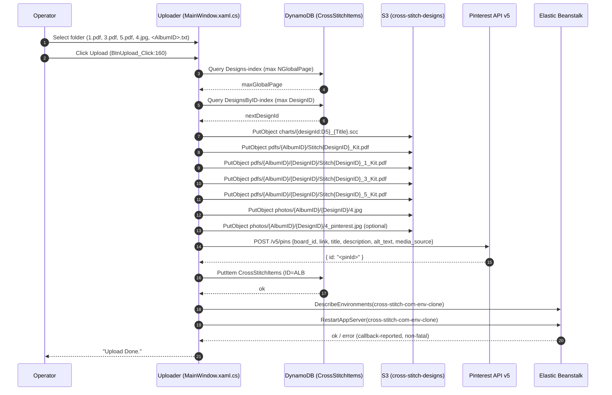

# Upload flow — design publish pipeline (F1)

> Contract type: workflow / multi-system orchestration
> Status: code-observed, undocumented prior to this contract
> Source of truth: `Uploader/MainWindow.xaml.cs` (`RunFullUploadFlowAsync`)

---

## 1. Contract Name

**Upload flow (F1 — design publish)**

The end-to-end sequence executed when the Uploader operator clicks **Upload** in the WPF tool. It publishes one new cross-stitch design across four external systems (S3, Pinterest, DynamoDB, Elastic Beanstalk) with no transaction boundary.

Implemented by `RunFullUploadFlowAsync` at `Uploader/MainWindow.xaml.cs:634`, triggered by `BtnUpload_Click` at `Uploader/MainWindow.xaml.cs:160`.

---

## 2. Purpose

A single click on **Upload** in the Uploader WPF window must produce a fully discoverable, fully linked design on `cross-stitch.com` such that the next page load on the site shows it:

1. Operator pre-selects a folder containing `1.pdf`, `3.pdf`, `5.pdf`, `4.jpg`, optional `4_pinterest.jpg`, and an `<AlbumID>.txt` marker file (`Uploader/MainWindow.xaml.cs:122-152`, `:600-624`).
2. `BtnUpload_Click` (`Uploader/MainWindow.xaml.cs:160`) validates pre-conditions and invokes `RunFullUploadFlowAsync` (`Uploader/MainWindow.xaml.cs:634`).
3. The flow writes the chart (`.scc`), four PDFs, one or two photos to S3, posts a Pinterest pin, inserts a single DynamoDB `DESIGN` row, and restarts Elastic Beanstalk so the cross-stitch Next.js app sees the new row.

This contract documents the exact sequence, what each step writes, the data carried between steps, and — critically — what state the system can be left in if any step fails.

---

## 3. Scope

### In scope

- The body of `RunFullUploadFlowAsync` (`Uploader/MainWindow.xaml.cs:634-676`) and its five direct sub-calls.
- The S3 keys, DynamoDB attribute set, Pinterest payload, and EB API call that constitute the side effects.
- Pre-conditions verified in `BtnUpload_Click` (`Uploader/MainWindow.xaml.cs:162-173`) and `CreatePatternInfoAsync` (`Uploader/MainWindow.xaml.cs:570-584`).
- Partial-failure and idempotency behavior.
- The audit tool `FindDesignsWithMissingPdfs` (`Uploader/MainWindow.xaml.cs:3620-3643`).

### Out of scope (covered by sibling contracts)

- S3 key naming conventions → see `s3-paths.md`.
- DynamoDB attribute schema → see `dynamodb-schema.md`.
- DesignID allocation semantics → see `design-id.md`.
- AlbumID generation → see `album-id.md`.
- Pinterest pin payload shape (title/description/alt_text construction) → see `pinterest-metadata.md`.
- PDF file structure (`1.pdf`, `3.pdf`, `5.pdf` source format) → see `pdf-structure.md`.
- Newsletter email send (`BtnSendEmails_Click` / `SendNotificationEmailsAsync` at `Uploader/MainWindow.xaml.cs:194` and `:678`) — that runs only when the operator separately clicks **Send Emails**; comment at `Uploader/MainWindow.xaml.cs:182` makes this explicit.

---

## 4. Data Formats

### 4.1 Sequence diagram



### 4.2 Numbered steps with code references

| # | Step | Code | Writes | Failure mode |
|---|------|------|--------|--------------|
| 0a | Pre-flight: PatternInfo must be loaded; folder + AlbumID must be set | `Uploader/MainWindow.xaml.cs:162-173` | none | Aborts before any side effect (`return` from handler) |
| 0b | Build `PatternInfo` from `1.pdf`, load `AlbumId` from `<id>.txt`, query DDB for `NPage` and `DesignID` | `Uploader/MainWindow.xaml.cs:570-584` (`CreatePatternInfoAsync`) calls `GetNextNPageAsync:805` and `GetNextDesignIdAsync:833` | none — DDB reads only | Throws `"Failed to load AlbumID from .txt file."` if marker missing (`:578`) |
| 1 | Re-query DDB for max `NGlobalPage` and max `DesignID` (re-compute right before upload) | `Uploader/MainWindow.xaml.cs:637-643`; `:779-803`; `:833-857` | none | If DDB unreachable, throws; nothing written yet |
| 2a | Upload chart to S3: `charts/{DesignID:D5}_{Title}.scc` | `UploadChartToS3Async` at `Uploader/MainWindow.xaml.cs:930-944` | 1 S3 object | Throws on S3 error; **no rollback** — but nothing else written yet |
| 2b | Upload 4 PDFs to S3: `pdfs/{AlbumID}/Stitch{DesignID}_Kit.pdf` + `pdfs/{AlbumID}/{DesignID}/Stitch{DesignID}_{1,3,5}_Kit.pdf` (each first converted via external `Converter.exe`) | `UploadPdfToS3Async` at `Uploader/MainWindow.xaml.cs:946-971`; `ConvertPdfForUploadAsync:973-1016`; `UploadPdfFileAsync:1018-1029` | 4 S3 objects | Throws if any of `1.pdf/3.pdf/5.pdf` missing (`:952-955`); throws if `Converter.exe` not found or non-zero exit (`:978-1013`); throws on S3 error. **Orphaned chart `.scc` from step 2a left in S3.** |
| 2c | Upload main photo `4.jpg` and optional `4_pinterest.jpg` | `UploadImageToS3Async:1031-1039`; `UploadPhotoFileAsync:1041-1055`; key built by `GetPhotoKey:2229` as `photos/{AlbumID}/{DesignID}/{fileName}` | 1–2 S3 objects | Throws on S3 error. **Orphaned chart + 4 PDFs left.** |
| 3 | Create Pinterest pin via `POST https://api.pinterest.com/v5/pins` | `UploadPinForPatternAsync` at `Uploader/Helpers/PinterestHelper.cs:63-149` | 1 Pinterest pin | Throws on non-2xx (`:136-140`) or missing `id` in response (`:142-146`); throws `"Pinterest pin was created without returning a pin ID."` if helper returns empty (`Uploader/MainWindow.xaml.cs:656-659`). **All S3 objects orphaned; no DDB row yet so the design is invisible to cross-stitch.** |
| 4 | DynamoDB `PutItem` into `CrossStitchItems` with `ID=ALB#{AlbumID:D4}`, `NPage`, `DesignID`, `EntityType=DESIGN`, `PinID`, `NGlobalPage`, `Caption`, `Description`, `Width`, `Height`, `NColors`, `Notes`, `NDownloaded=0` | `InsertItemIntoDynamoDbAsync` at `Uploader/MainWindow.xaml.cs:1057-1090`; partition key built at `:107` (`ALB#{albumId:D4}`) | 1 DDB row | Re-checks `PatternInfo.PinId` is non-empty (`:1062-1063`); throws on DDB error. **Pinterest pin is now orphaned** (it links to a design page that cross-stitch cannot render). |
| 5 | Restart Elastic Beanstalk env `cross-stitch-com-env-clone`: `DescribeEnvironments` then `RestartAppServer` | `_elasticBeanstalkHelper.RestartEnvironmentAsync` at `Uploader/Helpers/ElasticBeanstalkHelper.cs:24-73`; wired in `Uploader/MainWindow.xaml.cs:665-675` | 1 EB API call | **Soft failure** — exceptions are caught inside the helper (`:63-71`) and surfaced via the `statusCallback`; flow continues and returns success. The design row is published but the running app servers may still hold stale cache until manual intervention. |

### 4.3 Data carried through the flow

A single mutable `PatternInfo` instance (`Uploader/PatternInfo.cs:14-104`) is the spine. It accumulates state across steps:

| Field | Set by | Read by |
|-------|--------|---------|
| `Title`, `Notes`, `Description`, `Width`, `Height`, `NColors` | `PatternInfo` ctor (parses `1.pdf`) — `Uploader/PatternInfo.cs:111-134` | Step 2a (key), Step 3 (pin text), Step 4 (DDB attrs) |
| `AlbumId` | `LoadAlbumIdFromTxt` (`MainWindow.xaml.cs:575`, `:598-624`) | Steps 2b, 2c, 3, 4 |
| `NPage` | `GetNextNPageAsync` (`MainWindow.xaml.cs:580`, `:805-831`) — `(max NPage under ALB#{AlbumID:D4}) + 1`, zero-padded to 5 digits | Step 4 |
| `DesignID` | `GetNextDesignIdAsync` (`MainWindow.xaml.cs:643`, `:833-857`) — `(global max DesignID via DesignsByID-index) + 1`. **Re-queried right before upload** to reduce (but not eliminate) the race with a concurrent operator | Steps 2a, 2b, 2c, 3, 4 |
| `PinId` / `PinID` | Step 3 return value (`MainWindow.xaml.cs:652-654`) | Step 4 (written as DDB `PinID` attribute, `:1080`) |

### 4.4 Concrete S3 keys observed in code

```
charts/{DesignID:D5}_{Title}.scc                         (MainWindow.xaml.cs:933)
pdfs/{AlbumID}/Stitch{DesignID}_Kit.pdf                  (MainWindow.xaml.cs:957)
pdfs/{AlbumID}/{DesignID}/Stitch{DesignID}_1_Kit.pdf     (MainWindow.xaml.cs:959)
pdfs/{AlbumID}/{DesignID}/Stitch{DesignID}_3_Kit.pdf     (MainWindow.xaml.cs:960)
pdfs/{AlbumID}/{DesignID}/Stitch{DesignID}_5_Kit.pdf     (MainWindow.xaml.cs:961)
photos/{AlbumID}/{DesignID}/4.jpg                        (MainWindow.xaml.cs:73, :124, GetPhotoKey:2229-2232)
photos/{AlbumID}/{DesignID}/4_pinterest.jpg              (MainWindow.xaml.cs:74, :125, optional)
```

Bucket name: `cross-stitch-designs` (override `S3BucketName` app setting; default at `MainWindow.xaml.cs:46-47`; also hardcoded in the `S3Helper` instance at `:60`). Region: `us-east-1`.

### 4.5 DDB item written

Single PutItem to table `CrossStitchItems` (`MainWindow.xaml.cs:1085`), attributes from `:1065-1081`:

| Attribute | Type | Source |
|-----------|------|--------|
| `ID` | S | `ALB#{AlbumID:D4}` (`MainWindow.xaml.cs:107`) |
| `NPage` | S | 5-digit zero-padded (`GetNextNPageAsync:830`) |
| `AlbumID` | N | `_albumId` |
| `Caption` | S | `PatternInfo.Title` (from PDF) |
| `Description` | S | `PatternInfo.Description` (e.g. `"100 x 120 stitches 25 colors"`) |
| `DesignID` | N | from `GetNextDesignIdAsync` |
| `EntityType` | S | `"DESIGN"` |
| `Height`, `Width`, `NColors` | N | from `PatternInfo` |
| `NDownloaded` | N | `"0"` |
| `NGlobalPage` | N | `maxGlobalPage + 1` |
| `Notes` | S | from `PatternInfo` |
| `PinID` | S | from step 3 |

No conditional expression — see §9 idempotency.

### 4.6 Pinterest payload (Step 3)

`POST https://api.pinterest.com/v5/pins` (`Uploader/Helpers/PinterestHelper.cs:32`, `:128`):

```json
{
  "board_id": "<from AlbumBoards.csv keyed by AlbumID:D4, fallback PinterestBoardId app setting>",
  "link":     "<PatternLinkHelper.BuildPatternUrl(pattern)>",
  "title":    "<title – theme HumanName, printable PDF pattern, ≤100 chars>",
  "description": "<SEO blob + hashtags, ≤500 chars>",
  "alt_text": "<accessibility blob, ≤500 chars>",
  "media_source": {
    "source_type": "image_url",
    "url": "<PatternLinkHelper.BuildImageUrl(DesignID, AlbumId, photoFileName ?? \"4.jpg\")>"
  }
}
```

Board resolution from `AlbumBoards.csv` is lazy-loaded once per process (`PinterestHelper.cs:159-221`); see `pinterest-metadata.md` for the full title/description/hashtag rules.

---

## 5. API Endpoints / Interfaces

This contract has no HTTP API of its own. It is a composition of five external interface calls plus one UI event:

| # | Interface | Direction | Surface |
|---|-----------|-----------|---------|
| 1 | WPF Click event `BtnUpload_Click` | Operator → Uploader | `Uploader/MainWindow.xaml.cs:160` |
| 2 | AWS S3 `PutObject` via `TransferUtility.UploadAsync` (bucket `cross-stitch-designs`, region `us-east-1`) | Uploader → AWS | `Uploader/MainWindow.xaml.cs:935-944`, `:1018-1029`, `:1046-1054`; client at `:50`, `:65`, `:98` |
| 3 | Pinterest API v5 `POST /v5/pins` (Bearer OAuth) | Uploader → Pinterest | `Uploader/Helpers/PinterestHelper.cs:32`, `:128-133` |
| 4 | AWS DynamoDB `PutItem` (table `CrossStitchItems`, region `us-east-1`) | Uploader → AWS | `Uploader/MainWindow.xaml.cs:1083-1089`; client at `:49` |
| 5 | AWS Elastic Beanstalk `DescribeEnvironments` + `RestartAppServer` (env `cross-stitch-com-env-clone`, region `us-east-1`) | Uploader → AWS | `Uploader/Helpers/ElasticBeanstalkHelper.cs:34-58`; env name from `ElasticBeanstalkEnvironmentName` app setting at `MainWindow.xaml.cs:54-57` |

Reader side (consumed by cross-stitch Next.js) is **not** part of this contract: the cross-stitch app reads the DDB row and S3 photos/PDFs after the EB restart picks up cache invalidation. See `dynamodb-schema.md` and `s3-paths.md`.

---

## 6. Versioning

**Unversioned (implicit).** Neither the DDB row, the S3 keys, nor the Pinterest payload carry any contract-version field. Backward-compatibility is preserved by:

- Adding optional DDB attributes (existing items lack them; readers tolerate absence).
- Keeping S3 key templates stable across Uploader builds.

**Recommendation:** add an `UploaderSchemaVersion` numeric attribute to the DDB item and bump it whenever the attribute set in `InsertItemIntoDynamoDbAsync` (`MainWindow.xaml.cs:1065-1081`) changes. Without this, the cross-stitch app cannot detect when Uploader writes a new field shape.

---

## 7. Ownership & Contacts

- **Maintainer:** Olga (epolga).
- **Code owner (writer):** `Uploader/` repo (this code path is the sole writer of DESIGN rows and design-related S3 objects).
- **Reader (downstream impact):** `cross-stitch/` (Next.js app on `cross-stitch.com`); changes to step 4’s attribute set or step 2 key templates will silently break the reader. See `cross-stitch/src/lib/data-access.ts` for the consumer code path.

---

## 8. Dependencies

### External services

| Service | Resource | Source |
|---------|----------|--------|
| AWS S3 | bucket `cross-stitch-designs` | `MainWindow.xaml.cs:46-47`, `:60` |
| AWS DynamoDB | table `CrossStitchItems` (PK `ID`, SK `NPage`); GSIs `Designs-index`, `DesignsByID-index` | `MainWindow.xaml.cs:1085`, `:784`, `:838` |
| AWS Elastic Beanstalk | env `cross-stitch-com-env-clone`, region `us-east-1` | `MainWindow.xaml.cs:54-57` |
| Pinterest API v5 | `https://api.pinterest.com/v5/pins` | `PinterestHelper.cs:32`, `:128` |

### Local artifacts

| Artifact | Purpose | Source |
|----------|---------|--------|
| `Converter.exe` at `D:\ann\Git\Converter\bin\Release\net9.0\Converter.exe` | Re-renders each PDF before S3 upload (hardcoded absolute path) | `MainWindow.xaml.cs:84`, `:978-1015` |
| `AlbumBoards.csv` (configurable via `PinterestBoardsCsvPath`, default `AlbumBoards.csv`) | Maps 4-digit `AlbumID` → Pinterest `board_id` | `PinterestHelper.cs:47-49`, `:159-221` |
| Pinterest OAuth tokens at `Uploader/secrets/pinterest_tokens.json` | Bearer token for step 3; obtained via `PinterestOAuthClient.GetValidAccessTokenAsync` | `PinterestHelper.cs:41-42`, `:97` |

### Internal helpers

- `S3Helper` (`Uploader/Helpers/S3Helper.cs`) — instantiated at `MainWindow.xaml.cs:59-60` but **not used by `RunFullUploadFlowAsync`**; the flow uses the `TransferUtility` instance at `:65`/`:98` directly. `S3Helper` is used elsewhere (audits, ad-hoc uploads).
- `PinterestHelper` (`Uploader/Helpers/PinterestHelper.cs`) — owns step 3.
- `ElasticBeanstalkHelper` (`Uploader/Helpers/ElasticBeanstalkHelper.cs`) — owns step 5.
- `PatternLinkHelper` — builds the design URL embedded in the Pinterest pin (`PinterestHelper.cs:84-88`). See `s3-paths.md` and `pinterest-metadata.md`.

### Pre-conditions

| Pre-condition | Verified? | Where |
|---------------|-----------|-------|
| `PatternInfo` extracted (operator clicked **Extract** or it auto-ran from folder select) | yes | `MainWindow.xaml.cs:162-166` |
| `_batchFolderPath` and `txtAlbumNumber.Text` non-empty | yes | `MainWindow.xaml.cs:168-173` |
| `1.pdf`, `3.pdf`, `5.pdf` present | yes (twice: at folder select `:132-143`, and inside `UploadPdfToS3Async:952-955`) | |
| `4.jpg` present | implicitly — `UploadPhotoFileAsync` will throw if the path doesn’t exist | `:1041-1054` |
| `Converter.exe` present at hardcoded path | yes — `ConvertPdfForUploadAsync:978-979` throws `FileNotFoundException` | |
| Pinterest OAuth token valid / refreshable | yes — `GetValidAccessTokenAsync` throws on failure | `PinterestHelper.cs:97` |
| **ALBUM row exists in DDB for this `AlbumID`** | **NO** | not checked anywhere in the flow — see §9 |

---

## 9. Error Handling

This is the operationally critical section. Each step’s failure mode and the resulting cross-system state:

### 9.1 Per-step failure cascade

The flow is a straight `await … ConfigureAwait(false)` chain (`MainWindow.xaml.cs:634-676`) with a single outer `try/catch` at the click handler (`:177-191`). **There is no rollback or compensation logic.** When any step throws, all earlier writes remain.

| Failing step | Writes already committed | Writes skipped | Recovery cost |
|--------------|--------------------------|----------------|---------------|
| 1 — DDB read | none | all | retry; safe |
| 2a — chart S3 upload | none | all | retry; chart is overwritten on retry (S3 PutObject overwrites by key) |
| 2b — PDF S3 upload | chart `.scc` | all PDFs, photos, pin, DDB, EB | **orphan**: chart `.scc` left in S3; retry will overwrite it |
| 2c — photo S3 upload | chart + 4 PDFs | photos, pin, DDB, EB | **orphan**: chart + 4 PDFs in S3; retry overwrites them |
| 3 — Pinterest pin | all S3 objects | DDB, EB | **orphan**: all S3 keys present but the design is **invisible to cross-stitch** (DDB row never written); retry will create a **second** Pinterest pin (no idempotency key — see 9.2) |
| 4 — DDB PutItem | all S3 + 1 Pinterest pin | EB restart | **orphan**: Pinterest pin links to a `link` URL that 404s on cross-stitch.com; retry creates **another** pin. Manual pin deletion on Pinterest is required to clean up. |
| 5 — EB restart | all S3 + Pinterest pin + DDB row | nothing | **silent**: `ElasticBeanstalkHelper.RestartEnvironmentAsync` catches its own exceptions (`ElasticBeanstalkHelper.cs:63-71`) and returns `false`. The outer flow logs `"Elastic Beanstalk restart failed."` (`MainWindow.xaml.cs:672-674`) but still reports overall success at `:182`. **Design is published but the running app servers may serve stale content** until they’re manually restarted or naturally cycled. |

### 9.2 Idempotency

**`BtnUpload_Click` is not idempotent.** A double-click produces two full passes:

- The button is **not disabled** during execution. Compare with `BtnSendEmails_Click` at `:194-206` which guards via `_isSendingEmails`; no such guard exists for upload.
- `GetNextDesignIdAsync` is re-queried at step 1 (`:643`) immediately before step 2a, so two near-simultaneous clicks would race and *might* allocate the same `DesignID` (no `ConditionExpression` on the PutItem).
- S3 PutObject overwrites by key → step 2 is naturally idempotent **if the same `DesignID` is reused**, but if the second click re-queries and gets a different `DesignID` it writes a parallel set of objects.
- Pinterest `POST /v5/pins` is **not** idempotent — every retry creates a new pin (no `idempotency-key` header is sent; see `PinterestHelper.cs:111-133`).
- DDB `PutItem` (`:1083-1089`) has **no `ConditionExpression`** — a second click would silently overwrite the DDB row (same `ID` + `NPage` composite key only if `NPage` is reused; since `NPage` is re-queried, the second click most likely writes a *new* row, leading to two DESIGN rows sharing one `DesignID`).

### 9.3 Album-row precondition: NOT enforced

`CreatePatternInfoAsync` (`MainWindow.xaml.cs:570-584`) loads `AlbumId` only from the `<AlbumID>.txt` marker file (`:575`, `:598-624`). It does **not** query DynamoDB to verify that an `EntityType=ALBUM` row with `ID=ALB#{AlbumID:D4}` exists.

`InsertItemIntoDynamoDbAsync` (`MainWindow.xaml.cs:1057-1090`) likewise blindly writes a DESIGN row under `ID=ALB#{AlbumID:D4}` with no `Exists`-check on the parent.

**Consequence:** if the operator types an AlbumID that has no ALBUM row, the upload still succeeds and produces a DESIGN orphaned under a non-existent album. The cross-stitch site’s album page (`/Free-{slug}-Charts.aspx`) for that album would not list this design until the ALBUM row is created manually.

### 9.4 Audit tools and their blind spots

`FindDesignsWithMissingPdfs` at `Uploader/MainWindow.xaml.cs:3620-3643` (with `BuildExpectedPdfKeys` at `:3645-3658`) walks DDB DESIGN rows and reports any whose expected PDF S3 keys are missing.

**This detects DDB-without-S3** (failure mode unlikely in this flow because S3 writes happen before the DDB insert).

**This does NOT detect S3-without-DDB** — i.e. the more common partial-failure mode where steps 2a/2b/2c succeeded but step 3 or 4 failed, leaving S3 objects without a referencing DDB row. There is no audit tool for this direction; recovery requires manual S3 cleanup.

There is also **no audit for orphaned Pinterest pins** (case 9.1 row 4): a pin whose `link` field points to a design URL with no DDB row.

### 9.5 Recommended hardening (out of scope, but worth flagging)

- Disable the Upload button while the flow runs (mirror `_isSendingEmails`).
- Add a DDB `GetItem` precondition for the ALBUM row.
- Add an audit pass that lists S3 keys under `pdfs/`, `photos/`, `charts/` whose `DesignID` does not appear in any DDB DESIGN row.
- Add a Pinterest pin/DDB cross-check (DDB DESIGN rows whose `PinID` is empty or whose `PinID` is not in the Pinterest board listing).
- Wrap step 4 with a `ConditionExpression: "attribute_not_exists(ID)"` to make double-click a `ConditionalCheckFailedException` instead of a silent overwrite.

---

## 10. Security & Compliance

### Credentials

- **AWS:** the `AmazonS3Client`, `AmazonDynamoDBClient`, `AmazonElasticBeanstalkClient`, and `TransferUtility` are constructed with the default constructor (`MainWindow.xaml.cs:49-65`; `S3Helper.cs:20`; `ElasticBeanstalkHelper.cs:20`). This means the AWS SDK credential chain — environment variables, shared credentials file, or IAM role — is used silently. There is no code path that loads credentials explicitly. Operators run this on a developer workstation; misconfigured AWS profile = uploads go to the wrong account.
- **Pinterest:** Bearer token from `Uploader/secrets/pinterest_tokens.json` via `PinterestTokenInfo` + `PinterestOAuthClient` (`PinterestHelper.cs:41-42`, `:97`). This file is local-only and is the only ambient secret needed besides AWS.

### PII

- No user PII flows through this contract. The DDB row written contains pattern metadata only (`Caption`, `Description`, `Width`, `Height`, `NColors`, `Notes`, `PinID`). The newsletter flow (which *does* touch user emails) is intentionally a separate operator click — see `BtnSendEmails_Click:194` and the explicit comment at `MainWindow.xaml.cs:182`.

### Network egress

- S3 PutObject, DDB PutItem, EB API calls all hit AWS endpoints in `us-east-1`.
- Pinterest API hits `https://api.pinterest.com`. Response body is logged into the exception message on failure (`PinterestHelper.cs:138-139`), which could leak Pinterest API error text into Uploader status — not a confidentiality issue but worth knowing.

---

## 11. Testing & Validation

### Manual smoke test (recommended after any change to `RunFullUploadFlowAsync`)

1. **Set up a test folder** with `1.pdf`, `3.pdf`, `5.pdf`, `4.jpg`, and `<existingAlbumID>.txt` (e.g. `0018.txt` for album 18).
2. **Note the next expected `DesignID`** by running:
   ```
   aws dynamodb query --table-name CrossStitchItems --index-name DesignsByID-index ^
     --key-condition-expression "EntityType = :et" ^
     --expression-attribute-values "{\":et\":{\"S\":\"DESIGN\"}}" ^
     --scan-index-forward false --limit 1 --projection-expression DesignID
   ```
   Add 1 to the returned value — call it `D`.
3. **Click Upload** in Uploader; wait for `[Upload] Done.` in the status box.
4. **Verify S3 keys exist** (`B` = `cross-stitch-designs`, `A` = AlbumID):
   ```
   aws s3 ls s3://B/charts/    | findstr /R "^.*_.*\.scc"   (look for D padded to 5 digits)
   aws s3 ls s3://B/pdfs/A/    Stitch{D}_Kit.pdf
   aws s3 ls s3://B/pdfs/A/D/  Stitch{D}_{1,3,5}_Kit.pdf
   aws s3 ls s3://B/photos/A/D/  4.jpg (and 4_pinterest.jpg if used)
   ```
5. **Verify DDB row** exists:
   ```
   aws dynamodb get-item --table-name CrossStitchItems ^
     --key "{\"ID\":{\"S\":\"ALB#0018\"},\"NPage\":{\"S\":\"<NPage>\"}}"
   ```
   Confirm `EntityType=DESIGN`, `DesignID=D`, `PinID` present.
6. **Verify Pinterest pin appears** on the board mapped from `AlbumBoards.csv` for AlbumID `A`. The pin’s “Visit site” link must resolve to a real page on `cross-stitch.com`.
7. **Verify cross-stitch reflects the design**: visit `https://cross-stitch.com/Free-<albumSlug>-Charts.aspx` and confirm the new design tile loads (may take a minute for the EB restart to complete).

### Automated checks (suggested, not implemented)

- A script that diffs S3 keys under `pdfs/`, `photos/`, `charts/` against DDB DESIGN rows in both directions (extends `FindDesignsWithMissingPdfs` to catch S3-without-DDB).
- `grep` audit: `Grep -rn "RunFullUploadFlowAsync"` should return exactly one definition (`MainWindow.xaml.cs:634`) and one caller (`:179`). More than one caller indicates a refactor that needs review.

---

## 12. References

### Primary source

- `Uploader/MainWindow.xaml.cs:160` — `BtnUpload_Click` (entry point)
- `Uploader/MainWindow.xaml.cs:634-676` — `RunFullUploadFlowAsync` (the contract body)
- `Uploader/MainWindow.xaml.cs:930-944` — `UploadChartToS3Async`
- `Uploader/MainWindow.xaml.cs:946-971` — `UploadPdfToS3Async`
- `Uploader/MainWindow.xaml.cs:973-1016` — `ConvertPdfForUploadAsync`
- `Uploader/MainWindow.xaml.cs:1018-1029` — `UploadPdfFileAsync`
- `Uploader/MainWindow.xaml.cs:1031-1055` — `UploadImageToS3Async` / `UploadPhotoFileAsync`
- `Uploader/MainWindow.xaml.cs:1057-1090` — `InsertItemIntoDynamoDbAsync`
- `Uploader/MainWindow.xaml.cs:2229-2232` — `GetPhotoKey`
- `Uploader/MainWindow.xaml.cs:3620-3658` — `FindDesignsWithMissingPdfs` + `BuildExpectedPdfKeys`
- `Uploader/Helpers/S3Helper.cs` — alternate S3 helper (not used by F1 flow; used by other code paths)
- `Uploader/Helpers/PinterestHelper.cs:63-149` — `UploadPinForPatternAsync` (step 3)
- `Uploader/Helpers/ElasticBeanstalkHelper.cs:24-73` — `RestartEnvironmentAsync` (step 5)
- `Uploader/PatternInfo.cs` — data carrier across the flow

### Related contracts (do not duplicate)

- `s3-paths.md` — full S3 key naming rules (chart, PDF, photo).
- `dynamodb-schema.md` — table layout, PK/SK, GSIs, attribute types.
- `pinterest-metadata.md` — Pinterest pin payload shape, theme detection, hashtag rules.
- `design-id.md` — DesignID allocation algorithm (race window discussion).
- `album-id.md` — AlbumID format, 4-digit zero-padded partitioning rule (`ALB#{AlbumID:D4}`).
- `pdf-structure.md` — `1.pdf` / `3.pdf` / `5.pdf` source format and `Converter.exe` post-processing.

### Architecture context

- `cross-stitch-platform-docs/plan/platform-architecture-summary.md:103-110` — high-level summary of this flow.
- `cross-stitch-platform-docs/plan/platform-architecture-summary.md:218` — confirms EB restart is part of the flow.
- `cross-stitch-platform-docs/CLAUDE.md` — repo guardrails for documentation.
- `cross-stitch/src/lib/data-access.ts` — the reader-side consumer (out of this contract’s ownership, but the inverse interface).
