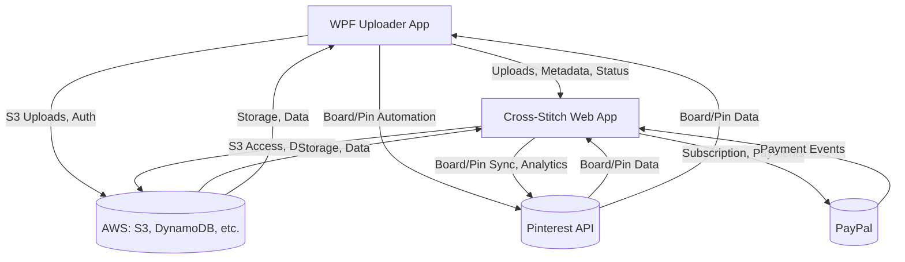

# Cross-Stitch Platform Integration Map

## Overview
This document visually maps the key integration points and data flows between the major components of the Cross-Stitch platform.

---

## Mermaid Diagram

---

## Integration Points
- Uploader ↔ Web App: Upload API, metadata sync, status updates
- Uploader ↔ AWS: S3 uploads, authentication, DynamoDB (if used)
- Uploader ↔ Pinterest: Board/pin creation, metadata automation
- Web App ↔ AWS: S3 access, DynamoDB, authentication
- Web App ↔ Pinterest: Board/pin sync, analytics
- Web App ↔ PayPal: Subscription and payment processing

## References
- See ARCHITECTURE-SUMMARY.md for a textual summary
- See CONTRACT-TEMPLATE.md for contract structure
- See individual contract files for details
